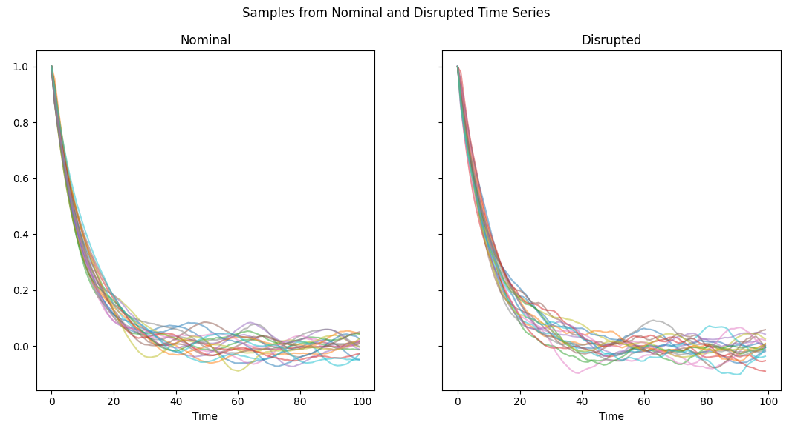
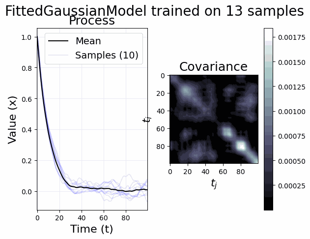
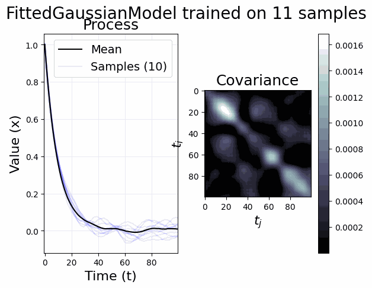
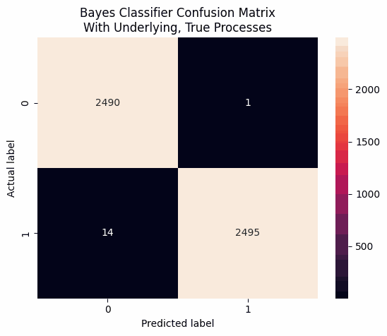
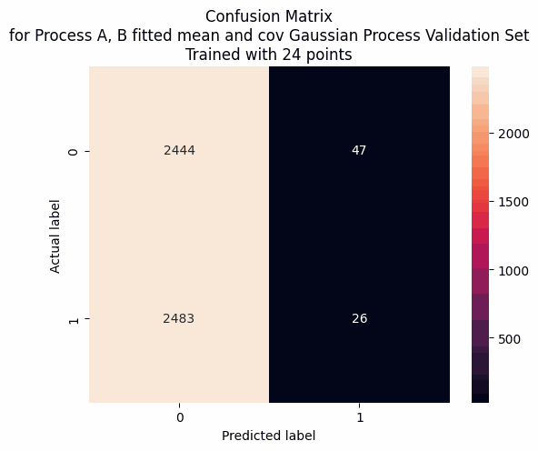
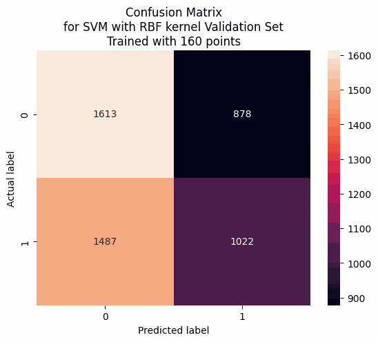

# informed_classification
Demonstration of ideas from scientific machine learning and informed ML

## Description

Tokamaks are donut-shaped magnetic-confinement fusion devices that keep plasma stable using strong magnetic fields. These plasmas can undergo **disruptions**-rapid loss of confinement events that can dump heat and induce forces on the vessel and first-wall components, risking serious damage if not mitigated [1,2,3]. On large devices (e.g., JET/ITER-like walls), disruptions and runaway-electron events pose substantial load and operational constraints [4,5].

If operators can **detect** impending or ongoing disruption states (ideally, the *type* of disruption) with enough lead time, mitigation systems (e.g., impurity injection) can trigger to limit damage [1]. Historically, real-time prediction/avoidance has relied on hand-crafted features and thresholds, plus classical ML (SVM/Random Forest/GBMs) integrated into control systems on several machines [6–10]. Deep-learning predictors and transfer-learning across devices are active research fronts [7,9,11].

**Why "informed" classification?** Many disruptive/nominal regimes have partial physics models, but real-time deployment can be constrained by missing physics or computational cost. Nominal plasma behavior is described by MHD/equilibrium theory (e.g., Grad–Shafranov) [12,13], while for *statistical* time-series modeling, Gaussian processes (GPs) are a flexible way to encode priors over trajectories [14,15]. 

In reality, we rarely have complete knowledge about the trajectories our dynamic system's states come from. If we knew nothing, it's clear that a traditional discriminative approach would be the best choice (NN, SVM, Random Forest, ...). If we knew the conditional distributions of nominal and disrupted/anomalous states, the optimal choice would be to use those as a Bayes classifier [16]. But what if we only knew the distribution of one state? Partial knowledge of a time-varying mean vector based on known physics? The covariance of the two states over time? 

The question this repo explores is: **when does using approximate knowledge about the conditional distributions beat generic discriminative baselines?** 
This aims to cut at an ongoing question in hybrid-ML (physics-/knowledge-informed), particularly for disruption prediction for nuclear fusion devices.

## Problem setup (toy analogue of disruption detection)

We study a controlled two-class time-series classification problem that mirrors “nominal vs disrupted” plasma states:

- Two hidden states generate length-T trajectories:
  - **Nominal:** a finite-time Gaussian process with mean μ<sub>A</sub>(t) and covariance Σ<sub>A</sub>.
  - **Disrupted:** a finite-time Gaussian process with mean μ<sub>B</sub>(t) and covariance Σ<sub>B</sub>.
- We can sample labeled trajectories from each class and wish to predict the class of a new trajectory.
- We then **vary how much of the true generative structure we "know"** and compare to a purely discriminative baseline.

As a sanity check: if you knew the *true* class-conditional distributions, the **Bayes classifier** attains the minimal achievable error (Bayes risk) [17,18].

### Visual intuition



## Models
We sweep the spectrum from "oracle knowledge" to "no prior knowledge":

1. **Bayes (oracle)** - uses the *true* $\mu_A,\Sigma_A$ and $\mu_B,\Sigma_B$ to compute class-conditional likelihoods and the Bayes decision rule. This is the optimal classifier.

2. **Informed generative models (fitted GPs)** — we estimate parts of the generative structure from data:

- **FittedGaussianModel:** estimate both mean and covariance for each class (μ<sup>̂</sup>, Σ<sup>̂</sup>).
- **FittedMeanGaussianModel:** estimate only means; use true covariance of the underlying process.
- **FittedCovGaussianModel:** assume the mean; estimate covariances.
- These form a family of **Informed Classifier** classifiers; performance tracks the quality of μ<sup>̂</sup>, Σ<sup>̂</sup>.

3. **Discriminative baseline** - a standard SVM (RBF) trained on trajectories (with simple normalization/whitening). This represents **no physics prior** and serves as a control.

## Key idea

> **How much partial generative knowledge is enough to consistently outperform a generic discriminative model?**  
> By sweeping what we fit (mean only, cov only, both) and the size of the labeled dataset, we chart where informed Informed Classifier wins versus an SVM.

## Dataset

We generate synthetic time-series under two GPs:

- **Nominal** uses an RBF-dominant kernel with small noise.
- **Disrupted** uses a higher-variance kernel and added short-range structure (e.g., periodic/RQ component) to mimic extra spectral content and variability.

See `informed_classification/generative_models.py` for exact kernels and sampling. The GP kernel zoo is inspired by Distill’s GP visual exploration [19].

## Results (illustrative)

>The GIFs below animate progressive fits of the informed models.

### Disrupted


### Nominal


### Validation confusion matrices

Row-normalized confusion matrices on the held-out **validation** set (rows = true class, columns = predicted class).

| Oracle Bayes (true GP) | Informed Classifier (fitted GP) | SVM baseline |
|:--:|:--:|:--:|
|  |  |  |

**How to read these:** diagonal = correct predictions; off-diagonal = misclassifications.  
**Typical pattern we observe:**
- **Oracle Bayes** is near-identity (upper-left/lower-right bright), setting the ceiling.
- **Fitted GP (Informed Classifier)** approaches the oracle as mean/covariance estimates improve with more data.
- **SVM baseline** tends to confuse classes when separability is primarily in **covariance** rather than mean differences; whitening helps but doesn’t fully close the gap.

**Takeaways (see report for more details):**
- The **oracle Bayes** is the optimal classifier and sets the performance ceiling.
- When the GP fit is not ill-conditioned due to low data, **fitted generative** models often **outperform SVM**, especially when classes differ primarily in covariance structure (a classic weak spot for margin methods on raw trajectories).
- Normalization helps SVM, but when separability is mostly in **covariance**, the informed models have a clear edge.
- As data grows and the fitted $\hat\mu,\hat\Sigma$ improve, Informed Classifier approaches the oracle.

## Setup


## Setup
Python $\ge$ $3.9 is required for this repo, it was developed with Python 3.11.5.

Install Poetry:
```sh
curl -sSL https://install.python-poetry.org | POETRY_VERSION=1.3.2 python -
```
Install informed_classification:
```
poetry install
```

Run tests:
```
poetry run pytest
```

## Running
First generate the data:
`poetry run python scripts/gen_data.py --config config_filename_in_config_dir`

Then run the script to evaluate the models based on the generated data:
`poetry run python scripts/evaluate_{MODEL_CLASS}.py --config config_filename_in_config_dir` 

## References

[1] Hollmann, E.M., Commaux, N., Eidietis, N.W., *Status of research toward the ITER disruption mitigation system*, **Physics of Plasmas**, 2015. https://doi.org/10.1063/1.4901251

[2] de Vries, P.C., Arnoux, G., Huber, A., et al., *The impact of the ITER-like wall at JET on disruptions*, **Plasma Physics and Controlled Fusion**, 2012. https://doi.org/10.1088/0741-3335/54/12/124032

[3] Pautasso, G., de Vries, P.C., Humphreys, D., et al., *The ITER disruption mitigation trigger: developing its preliminary design*, **Nuclear Fusion**, 2018. https://doi.org/10.1088/1741-4326/aaa137

[4] Reux, C., Plyusnin, V., Lehnen, M., et al., *Runaway beam studies during disruptions at JET-ILW*, **Journal of Nuclear Materials**, 2015. https://doi.org/10.1016/j.jnucmat.2014.12.104

[5] Hollmann, E.M., Arnoux, G., Commaux, N., et al., *Plasma–surface interactions during tokamak disruptions and rapid shutdowns*, **Journal of Nuclear Materials**, 2011. https://doi.org/10.1016/j.jnucmat.2010.10.009

[6] Vega, J., Murari, A., Dormido-Canto, S., et al., *Results of the JET real-time disruption predictor in the ITER-like wall campaigns*, **Fusion Engineering and Design**, 2013. https://doi.org/10.1016/j.fusengdes.2013.03.012

[7] Hu, W.H., Chen, Z.Y., Li, D., et al., *Real-time prediction of high-density EAST disruptions using Random Forest*, **Nuclear Fusion**, 2021. https://doi.org/10.1088/1741-4326/abf0f3

[8] Zhong, Y., Feng, X., Li, D., et al., *Disruption prediction and model analysis using LightGBM on J-TEXT and HL-2A*, **Plasma Physics and Controlled Fusion**, 2021. https://doi.org/10.1088/1361-6587/abfa74

[9] Lee, J., Kim, J., Yoo, M-G., et al., *Data-driven disruption prediction using Random Forest in KSTAR*, **Fusion Engineering and Design**, 2024. https://doi.org/10.1016/j.fusengdes.2023.114124

[10] Esquembri, S., Vega, J., Murari, A., et al., *Real-Time Implementation in JET of the SPAD Disruption Predictor Using MARTe*, **IEEE Transactions on Nuclear Science**, 2018. https://doi.org/10.1109/TNS.2018.2791719

[11] Zheng, W., Xue, F., Chen, Z., et al., *Disruption prediction for future tokamaks using parameter-based transfer learning*, **Communications Physics**, 2023. https://doi.org/10.1038/s42005-023-01296-9

[12] Freidberg, J.P., *Ideal MHD*, **Cambridge University Press**, 2014. https://doi.org/10.1017/CBO9781139060004

[13] Guazzotto, L., Freidberg, J.P., *A family of analytic equilibrium solutions for the Grad–Shafranov equation*, **Physics of Plasmas**, 2007. https://doi.org/10.1063/1.2794019

[14] Rasmussen, C.E., Williams, C.K.I., *Gaussian Processes for Machine Learning*, **MIT Press**, 2006. https://gaussianprocess.org/gpml/

[15] Görtler, J., Kehlbeck, R., Deussen, O., *A Visual Exploration of Gaussian Processes*, **Distill**, 2019. https://distill.pub/2019/visual-exploration-gaussian-processes/

[16] Hastie, T., Tibshirani, R., Friedman, J., *The Elements of Statistical Learning* (2nd ed., “The Bayes Classifier”), **Springer**, 2009. https://hastie.su.domains/ElemStatLearn/

[17] Bishop, C.M., *Pattern Recognition and Machine Learning* (Bayes decision theory, Ch. 1), **Springer**, 2006. (Open PDF) https://www.microsoft.com/en-us/research/uploads/prod/2006/01/Bishop-Pattern-Recognition-and-Machine-Learning-2006.pdf

[18] Hastie, T., Tibshirani, R., Friedman, J., *The Elements of Statistical Learning* (2nd ed.), **Springer**, 2009. https://hastie.su.domains/ElemStatLearn/
